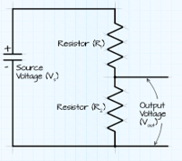

### Description
This project is based on the nRF52840 ProMicro board. The project is created in visual studio code using the nrf connect sdk.

The purpose is to read voltage from a 72V Lithium Ion battery pack. 

There is a voltage divider using R1 and R2 with values of 240k and 10k (see main_voltage.c) to provide a suitable voltage level to the board.

*Figure 1: General voltage divider to keep track of R1, and R2 respectively*

There is a reading of internal temperature.

The voltage and the temperature transmitted via ble advertising in connected mode.

### ToDo
Add external temperature sensor to keep close to the batteries.
